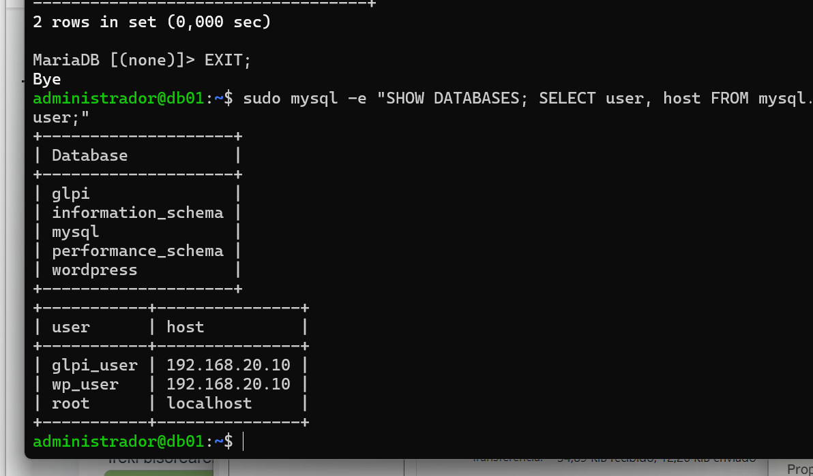
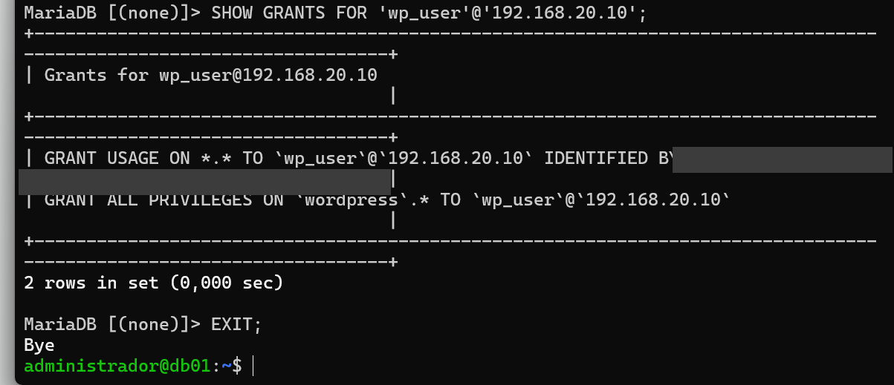
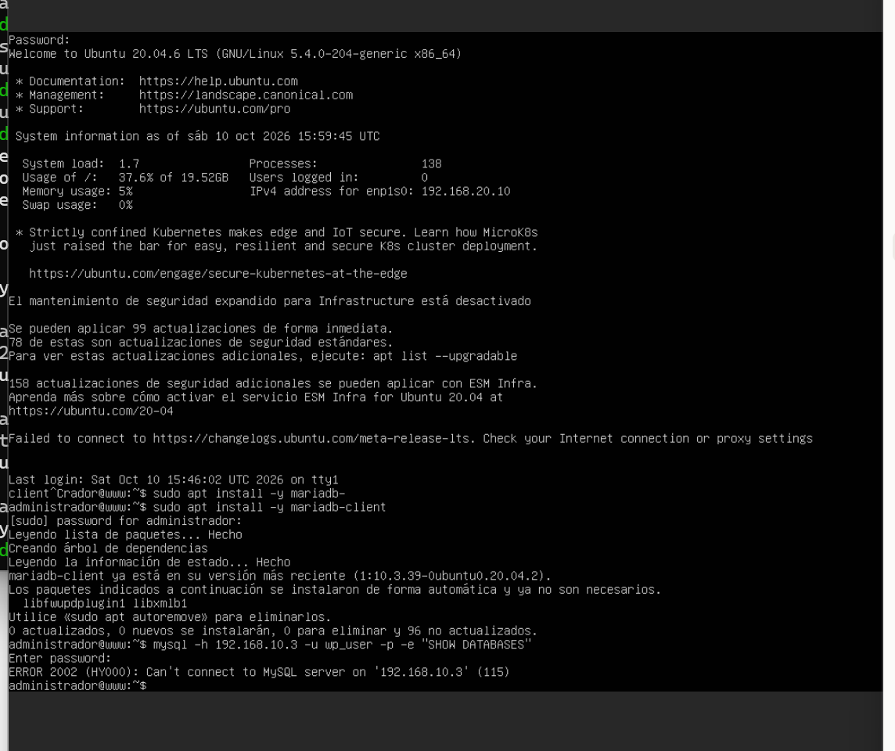
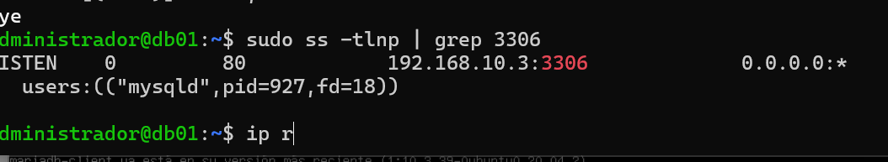
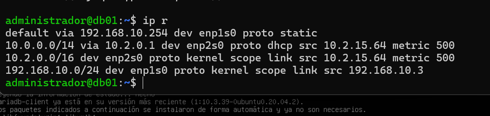
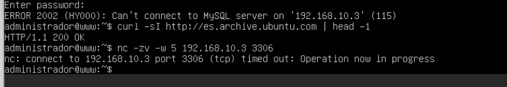
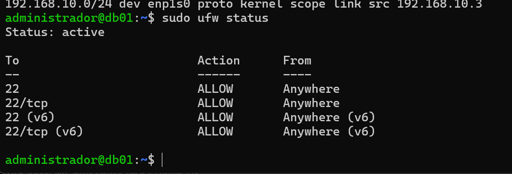
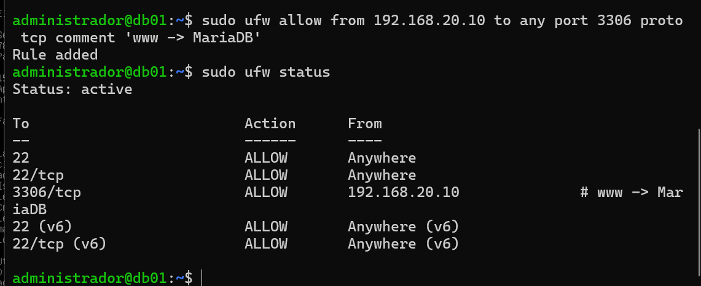
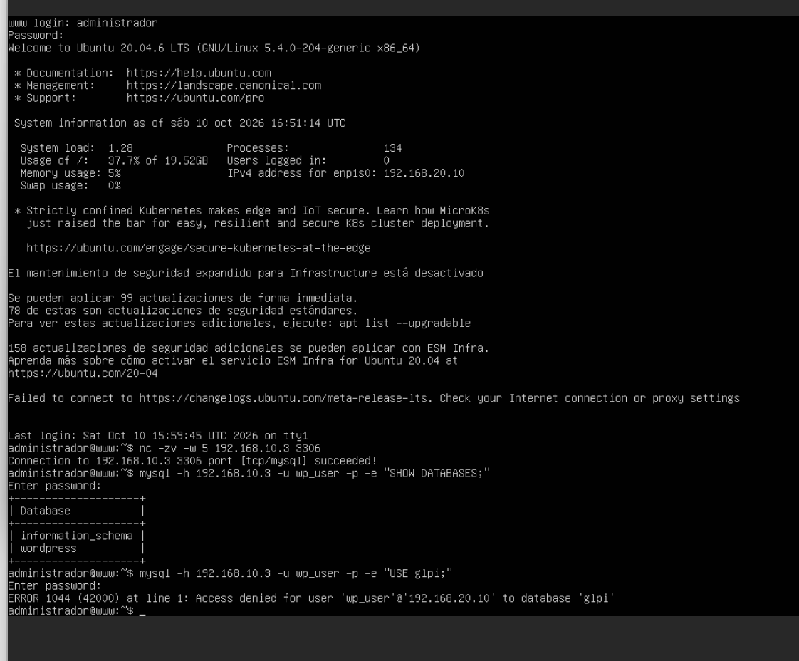

[← Hasiera](../../index.md) · [Modulua](index.md)

# Datu-baseak (MariaDB)

## Aukerak

| DBKS | Lizentzia / kostua | HW gutxieneko eskakizunak | Alde onak | Alde txarrak |
|---|---|---|---|---|
| **MariaDB** | GPL · 0 € | 1 vCPU · 512 MB RAM · ~200 MB diskoa | MySQL-rekin bateragarria; WordPress-ek eta GLPIk ofizialki onartzen dute; Ubuntu-ko biltegietan; komunitate handia | Funtzio aurreratu gutxiago PostgreSQL baino |
| MySQL (Community) | GPL · 0 € (Oracle) | Antzekoak | WordPress/GLPI-rekin bateragarria | Oracle-ren menpe; funtzio batzuk Enterprise bertsioan bakarrik |
| PostgreSQL | PostgreSQL License · 0 € | 1 vCPU · 1 GB RAM | Oso osatua eta estandarra | WordPress-ek ez du ofizialki onartzen |
| SQL Server Express | Doakoa (10 GB muga) | 2 vCPU · 2 GB RAM, Windows | Windows/AD integrazioa | Ez du WordPress/GLPI onartzen; muga; Windows lizentzia |
| MongoDB | SSPL · 0 € | 2 GB RAM gomendatua | NoSQL, dokumentuak (JSON) | WordPress eta GLPIk ez dute erabiltzen (SQL behar dute) |

**Erabakia: MariaDB**, `db01` zerbitzarian (Ubuntu Server 20.04, LAN, 192.168.10.3).
- WordPress-ek eta GLPIk biek behar dute MySQL/MariaDB → DBKS bakarra bi aplikazioentzat.
- Kostua 0 € eta HW eskakizun txikiak.
- **LANean** dago, ez DMZn: pazienteen datuak dituenez, web zerbitzaria erasotzen badute ere datuak suebakiaren atzean geratzen dira; www-k bakarrik sar daiteke, 3306 portutik (suebakiaren 1. araua).

## Zerbitzaria

| Datua | Balioa |
|---|---|
| Izena | db01.biohealth.local |
| Sistema | Ubuntu Server 20.04 LTS (IsardVDI txantiloia) |
| Sarea | Pertsonala1 (LAN) · 192.168.10.3/24 · atebidea 192.168.10.254 · DNS 192.168.10.1 |
| Baliabideak | 2 vCPU · 2 GB RAM |

### Sare-konfigurazioa

`/etc/netplan/00-installer-config.yaml` (www-ren berdina, LANeko IPekin):

```yaml
network:
  version: 2
  ethernets:
    enp1s0:
      dhcp4: false
      addresses:
        - 192.168.10.3/24
      gateway4: 192.168.10.254
      nameservers:
        addresses: [192.168.10.1]
        search: [biohealth.local]
```


*Irudia: db01-en netplan fitxategia (koska zuzenekin).*


*Irudia: `enp1s0` UP 192.168.10.3/24, lehenetsitako bidea pfSense-ra (192.168.10.254) eta DCra ping-a OK (0% packet loss). ✅*

| Arazoa | Kausa | Konponbidea |
|---|---|---|
| `gateway4: 192.168.10.3/24` idatzi zen | Atebidean makinaren IP propioa eta maskara | Atebidea = pfSense (`192.168.10.254`), maskararik gabe |
| `netplan apply` → *Invalid YAML: inconsistent indentation* (6. lerroa) | `addresses:`-ek `dhcp4:`-ek baino zuriune gehiago zituen | Maila bereko lerroak (dhcp4, addresses, gateway4, nameservers) 6 zuriunetan lerrokatu (`nano -l` lerro-zenbakiekin) |

## Instalazioa 🔄

```bash
sudo apt update
sudo apt install -y mariadb-server
systemctl status mariadb --no-pager
mysql --version
sudo ss -tlnp | grep 3306
```


*Irudia: **MariaDB 10.3.39** instalatuta eta `active (running)`, abiaraztean automatikoki gaituta (`enabled`). Hasieran `127.0.0.1:3306`-en bakarrik entzuten du (lokalean), segurtasunagatik lehenetsita. ✅*

### Instalazioa segurtatu (`mysql_secure_installation`)

| Galdera | Erantzuna | Zergatik |
|---|---|---|
| Set root password? | **n** | Ubuntu-n MariaDBko `root`-ek *unix_socket* autentifikazioa erabiltzen du: sistemako `sudo` behar da, ez pasahitz bat → ezin da sare bidez asmatu |
| Remove anonymous users? | Y | Erabiltzailerik gabe inor ez sartzeko |
| Disallow root login remotely? | Y | `root` makina beretik bakarrik |
| Remove test database? | Y | Edonork atzi zezakeen proba-datu-basea |
| Reload privilege tables? | Y | Aldaketak berehala aplikatu |


*Irudia: `mysql_secure_installation` osatuta: erabiltzaile anonimoak eta `test` datu-basea ezabatuta, root urrunetik debekatuta. ✅*


*Irudia: `sudo mysql` (unix_socket) bidez root gisa sartuta: sistemaren datu-baseak bakarrik (`information_schema`, `mysql`, `performance_schema`); `test` jada ez dago. ✅*

### Sarera ireki (`bind-address`)

Lehenetsita MariaDBk `127.0.0.1`-en bakarrik entzuten du; www-k konektatu ahal izateko LANeko IPan entzun behar du:

```bash
sudo sed -i 's/^bind-address.*/bind-address            = 192.168.10.3/' /etc/mysql/mariadb.conf.d/50-server.cnf
sudo systemctl restart mariadb
sudo ss -tlnp | grep 3306
```

**Zergatik `192.168.10.3` eta ez `0.0.0.0`:** LANeko txartelean bakarrik entzuteko. Gainera, suebakiak (1. araua) www-ri bakarrik uzten dio 3306 portura iristen, eta MariaDBko erabiltzaileak `@'192.168.20.10'` bezala sortzen dira → hiru babes-geruza.


*Irudia: MariaDB orain `192.168.10.3:3306`-en entzuten. ✅*

> Oharra: IsardVDIko kontsola nabigatzailean dago; nano-n `Ctrl+W` (bilatu) sakatzean nabigatzaileak fitxa ixten du. Horregatik `sed` erabili da (edo nano-n `F6`).

## Ustiapen-ezaugarriak ⏳

| Parametroa | Balioa |
|---|---|
| Portua | 3306/TCP |
| Konfigurazio-fitxategia | `/etc/mysql/mariadb.conf.d/50-server.cnf` |
| `bind-address` | `192.168.10.3` |
| Pizte / itzaltzea / egoera | `systemctl start / stop / restart / status mariadb` |
| Konexio-parametroak | `max_connections`, `MAX_USER_CONNECTIONS` |
| Logak | `/var/log/mysql/error.log` · `journalctl -u mariadb` |
| Baliabideak (RAM, diskoa) | |

## Datu-baseak eta erabiltzaileak ✅

| Datu-basea | Erabiltzailea | Nondik | Baimenak | Zergatik |
|---|---|---|---|---|
| `wordpress` | `wp_user` | `192.168.20.10` (www) | `wordpress.*`-n ALL | Gutxieneko pribilegioa: bere datu-basea bakarrik, eta www-tik bakarrik |
| `glpi` | `glpi_user` | `192.168.20.10` (www) | `glpi.*`-n ALL | Berdin |

```sql
CREATE DATABASE wordpress CHARACTER SET utf8mb4 COLLATE utf8mb4_unicode_ci;
CREATE DATABASE glpi CHARACTER SET utf8mb4 COLLATE utf8mb4_unicode_ci;
CREATE USER 'wp_user'@'192.168.20.10' IDENTIFIED BY '********';
GRANT ALL PRIVILEGES ON wordpress.* TO 'wp_user'@'192.168.20.10';
CREATE USER 'glpi_user'@'192.168.20.10' IDENTIFIED BY '********';
GRANT ALL PRIVILEGES ON glpi.* TO 'glpi_user'@'192.168.20.10';
FLUSH PRIVILEGES;
```

- **Gutxieneko pribilegioa:** aplikazio bakoitzak bere erabiltzailea eta bere datu-basea; WordPress erasotzen badute ezin dute GLPIren daturik irakurri.
- **`@'192.168.20.10'`:** erabiltzaileak www-tik bakarrik konekta daitezke; beste edozein IPtatik MariaDBk ukatzen du, pasahitza jakin arren.
- **`utf8mb4`:** karaktere guztiak (azentuak, ñ, emojiak) gordetzeko.
- Pasahitzak ez dira biltegian gordetzen. Laborategian pasahitz bera erabili da hainbat zerbitzutan (domeinua, pfSense, MariaDB) ez ahazteko; **enpresa erreal batean** zerbitzu bakoitzak berea izango luke, pasahitz-kudeatzaile batean (adib. KeePass) gordeta.


*Irudia: `wordpress` eta `glpi` datu-baseak sortuta; erabiltzaileak: `glpi_user@192.168.20.10`, `wp_user@192.168.20.10` eta `root@localhost` (anonimorik ez). ✅*


*Irudia: `SHOW GRANTS FOR 'wp_user'@'192.168.20.10'`: `USAGE` (konektatzeko baimena bakarrik, ezer gehiago ez) eta `ALL PRIVILEGES` `wordpress` datu-basean soilik. Pasahitzaren hash-a ezkutatuta. ✅*

### Diagnostikoa: 2002 errorea pausoz pauso

| # | Proba | Emaitza | Ondorioa |
|---|---|---|---|
| 1 | db01: `ss -tlnp \| grep 3306` | `192.168.10.3:3306` LISTEN | MariaDB ondo ✅ |
| 2 | db01: `ip r` | default via 192.168.10.254; VPN txartela 10.x-rako bakarrik | Itzulerako bidea ondo ✅ |
| 3 | www: `curl http://es.archive.ubuntu.com` | `HTTP/1.1 200 OK` | pfSense-k DMZ bideratzen du ✅ |
| 4 | www: `nc -zv -w 5 192.168.10.3 3306` | `timed out` | 3306 bakarrik blokeatuta ❌ |
| 5 | db01: `sudo ufw status` | `active`, 22 bakarrik | **Kausa aurkituta** |


*Irudia: www-tik konektatzean `ERROR 2002 … (115)`.*


*Irudia: MariaDB 192.168.10.3:3306-en entzuten.*


*Irudia: db01-en bideak: lehenetsitakoa pfSense-ra.*


*Irudia: www-k Internetera irteten du, baina 3306 portuak timeout ematen du.*


*Irudia: db01-en ufw aktibo, 22 portua bakarrik.*


*Irudia: konponbidea: 3306/tcp baimendua **192.168.20.10-etik bakarrik**. ✅*

**Defentsa sakonean** — datu-basera iristeko 4 geruza: (1) pfSense 1. araua, (2) db01-en ufw, (3) `bind-address`, (4) MariaDBko erabiltzailea `@'192.168.20.10'`.

## Probak (www-tik) ✅

| Proba | Espero dena | Emaitza |
|---|---|---|
| `nc -zv -w 5 192.168.10.3 3306` | ✅ portua irekita | ✅ `succeeded` |
| `mysql -h 192.168.10.3 -u wp_user -p -e "SHOW DATABASES;"` | ✅ `wordpress` bakarrik | ✅ `information_schema` + `wordpress` (ez glpi, ez mysql) |
| `mysql -h 192.168.10.3 -u wp_user -p -e "USE glpi;"` | ❌ ukatuta | ✅ `ERROR 1044 (42000): Access denied for user 'wp_user'@'192.168.20.10' to database 'glpi'` |


*Irudia: www-tik (DMZ) db01-era (LAN) konexioa: pfSense-ren 1. araua eta db01-en ufw-a gainditzen ditu; `wp_user`-ek bere datu-basea bakarrik ikusten du eta `glpi`-ra sartzean 1044 errorea → gutxieneko pribilegioa funtzionatzen du. ✅*

## Logak eta erroreak 🔄

### Errore-mezuen interpretazioa

| Errorea | Esanahia | Kausa | Konponbidea |
|---|---|---|---|
| (errorerik gabe) erabiltzaileen pasahitza gidako adibidea zen (`TU_CONTRASEÑA`) | Komandoa adibidearen testua aldatu gabe kopiatu zen; `SHOW GRANTS`-eko hash-a egiaztatuz aurkitu zen | `ALTER USER '...'@'192.168.20.10' IDENTIFIED BY '********';` bi erabiltzaileentzat. Bash-en `!` duten pasahitzak `"..."` barruan *event not found* ematen du → `sudo mysql` barruan exekutatu |
| `ERROR 1044 (42000): Access denied for user 'wp_user'@'192.168.20.10' to database 'glpi'` | Baimen-errorea: erabiltzailea autentifikatuta dago, baina ez du datu-base horretarako baimenik | Nahita egindako proba: `wp_user`-ek `wordpress.*`-n bakarrik ditu baimenak | — (espero zen portaera) |
| `ERROR 2002 (HY000): Can't connect to MySQL server on '192.168.10.3' (115)` (www-tik) | TCP konexioa ezin izan da ezarri; **(115)** = itxaroten geratu da erantzunik gabe (*timeout*). Ez da pasahitza (hori 1045 izango litzateke) ezta MariaDB itzalita ere (hori (111) *refused* izango litzateke) | db01-k **ufw** suebakia aktibo zuen (IsardVDI txantiloitik), 22 portua bakarrik baimenduta | `sudo ufw allow from 192.168.20.10 to any port 3306 proto tcp comment 'www -> MariaDB'` |
| `ERROR 1064 (42000) ... near ':' at line 1` | SQL sintaxi-errorea; MariaDBk zehazten du non: `':'` ikurraren ondoan | `SHOW DATABASES:` — aginduaren amaieran `;` ordez `:` idatzi zen | `SHOW DATABASES;` → ondo (ikus goiko irudia) |


*Irudia: `SELECT VERSION()` ondo exekutatu da (10.3.39-MariaDB-0ubuntu0.20.04.2), baina bigarren aginduak 1064 errorea eman du sintaxi-akats batengatik. Mezuak errore-kodea, SQLSTATE (42000) eta kokapena (`near ':'`) ematen ditu.*
