[← Hasiera](../../index.md) · [Modulua](index.md)

# Active Directory

## Aukerak

| Aukera | Alde onak | Alde txarrak |
|---|---|---|
| **Windows Server + AD DS** | Erronkak Windows domeinua eskatzen du; AD DS, DNS, DHCP eta inprimaketa zerbitzari berean; GPOak | Lizentzia ordainpekoa |
| Samba 4 AD DC | Doakoa | GPO kudeaketa mugatuagoa; konplexuagoa |
| FreeIPA / OpenLDAP | Doakoa, Linux | Ez ditu Windows bezeroak GPOekin kudeatzen |
| Microsoft Entra ID | Hodeian | Osasun-datuak kanpoan; ez da instalatzen |

**Erabakia: Windows Server 2019 + AD DS** (ikus [proposamena vs. inplementazioa](../00-orokorra/proposamena-vs-inplementazioa.md)).

## Zerbitzaria

| Datua | Balioa |
|---|---|
| Host-izena | `zerbitzariprintzipala` (NetBIOS: `ZERBITZARIPRINT`, 15 karaktereko muga) |
| IP | 192.168.10.1/24 · atebidea 192.168.10.254 · DNS 127.0.0.1 |
| Rolak | AD DS, DNS, DHCP, Inprimaketa eta dokumentu zerbitzuak |
| Basoa / domeinua | `biohealth.local` (baso berria) · NetBIOS `BIOHEALTH` |
| Administrari-kontua | `BIOHEALTH\Administrador` (pasahitza ez da hemen jasotzen) |

## OU egitura

```
biohealth.local
└── Departamentuak
    ├── Administrariak   → admin1, admin2, admin3        · taldea: administrariak
    ├── Erizaintza       → erizain1, erizain2, erizain3  · taldea: erizaintza
    ├── Harrera          → harrera1, harrera2, harrera3  · taldea: harrera
    ├── Informatika      → infor1, infor2, infor3        · taldea: informatika
    └── Medikuntza       → mediku1, mediku2, mediku3     · taldea: medikuntza
```

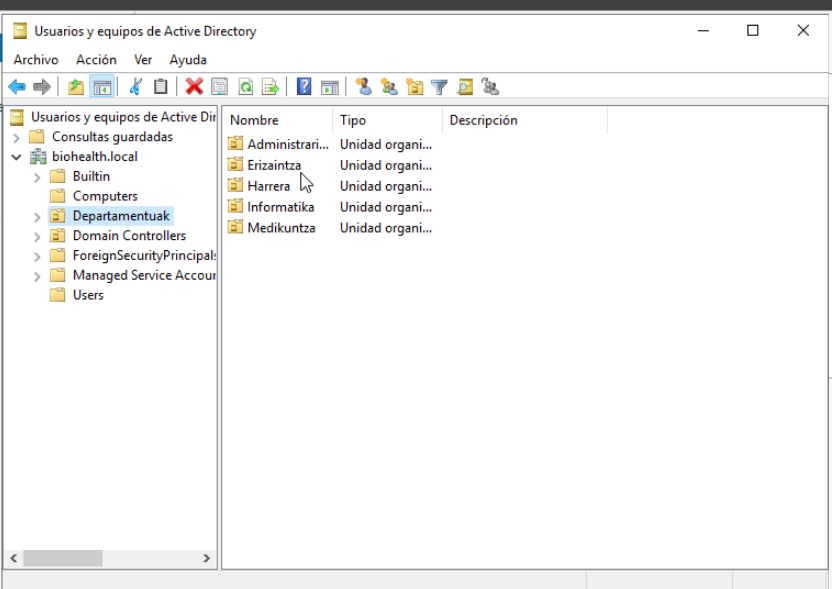
*Irudia: `Departamentuak` OUaren barruan sail bakoitzeko OU bat: Administrariak, Erizaintza, Harrera, Informatika eta Medikuntza. ✅*

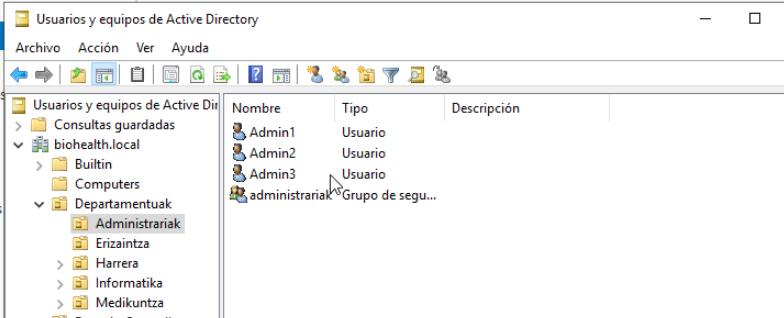
*Irudia: `Administrariak` OUa: Admin1, Admin2 eta Admin3 erabiltzaileak eta `administrariak` segurtasun-taldea. Gainerako OUek egitura bera dute (3 erabiltzaile + taldea). ✅*

**Zergatik egitura hau:** OU bat sail bakoitzeko GPOak sailka aplikatzeko; talde bat sail bakoitzeko baimenak (inprimagailuak, karpetak) taldeka emateko, ez erabiltzaileka.

## GPOak 🔄

### Aukerak

| Aukera | Erabiltzaile askorentzat | Talde konkretu batentzat | Balorazioa |
|---|---|---|---|
| A. Taldearen hasierako GPOak bakarrik | Panel_Blokeatu + Itzali_ez (arau 1 bakoitza) | — | Errubrikak 2 arau eta talde konkretu baterako GPO bat eskatzen ditu |
| **B. Lehendik daudenak osatu + Harrerarentzat bat** | **Panel_Blokeatu**: Kontrol-panela + CMD, Informatika kanpoan | **GPO-Harrera**: pantaila-blokeoa 5 min + USB debekatuta | ✅ Ez da ezer berriz egiten; arau bakoitzak arrazoi erreala du |
| C. GPO berri guztiak | — | — | Taldearen lana bikoiztu |

**Erabakia: B.** Langileek ezin dute sistemaren konfigurazioa aldatu (Kontrol-panela, CMD); Informatika kanpoan dago, ekipoak mantentzen dituelako. Harrera publikoarekin dagoen postua da (pazienteak aurrean): pantaila bakarrik blokeatu behar da eta datuak ezin dira USB batean atera.

| GPO | Lotuta | Arauak | Iragazkia | Errubrika |
|---|---|---|---|---|
| **Panel_Blokeatu** | Departamentuak (15 erabiltzaile) | 1) Kontrol-panela eta PC konfigurazioa debekatuta · 2) CMD debekatuta (scriptak bai) | `informatika` taldeari **Ukatu** «Aplicar directiva de grupo» | Erabiltzaile askorentzat ✅ |
| **Itzali_ez** | Departamentuak | Itzali, berrabiarazi, eseki eta hibernatu komandoak kendu | — | Gehigarria: ekipoak piztuta eguneraketa eta babeskopietarako |
| **GPO-Harrera** | Harrera (3 erabiltzaile) | 1) Pantaila-babeslea pasahitzarekin 300 s · 2) USB biltegiratzea debekatuta | — | Talde konkretu batentzat ✅ |

### Panel_Blokeatu

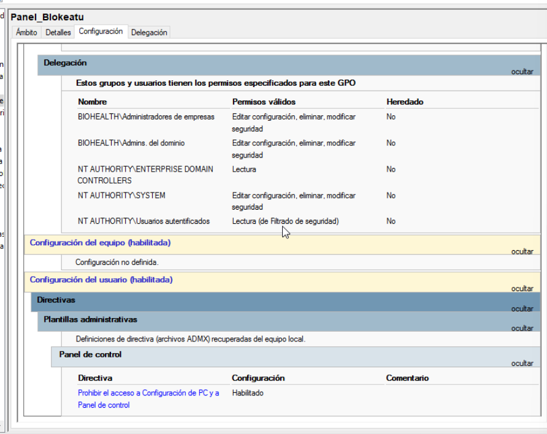
*Irudia: hasieran arau bakarra zuen: «Prohibir el acceso a Configuración de PC y a Panel de control».*

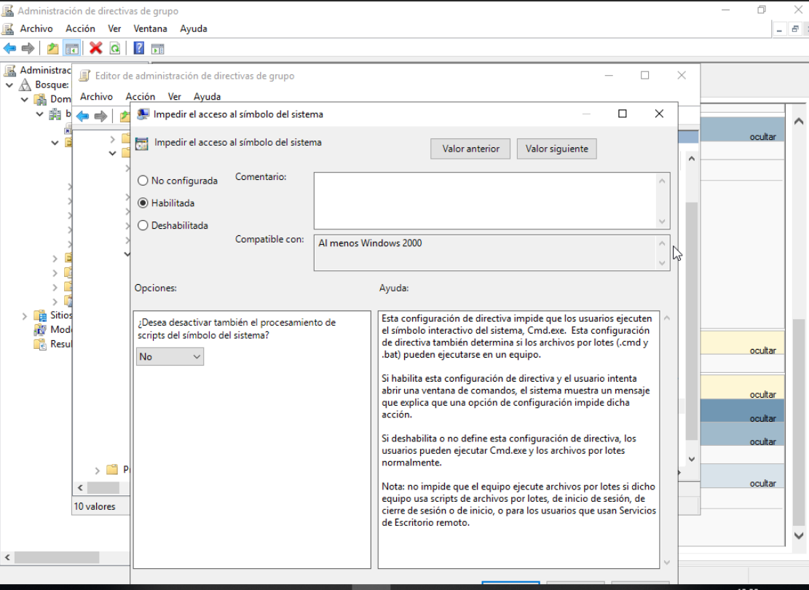
*Irudia: bigarren araua gehituta: «Impedir el acceso al símbolo del sistema» → Habilitada. Scripten prozesamendua **ez** da desaktibatzen, saio-hasierako scriptek funtziona dezaten.*

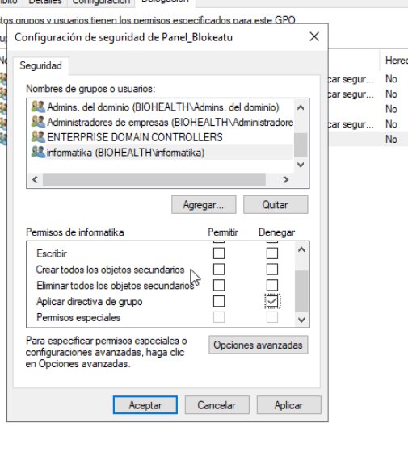
*Irudia: segurtasun-iragazkia: `informatika` taldeari «Aplicar directiva de grupo» baimena **ukatuta**; GPOa ez zaie aplikatzen Informatikako langileei.*

### Itzali_ez

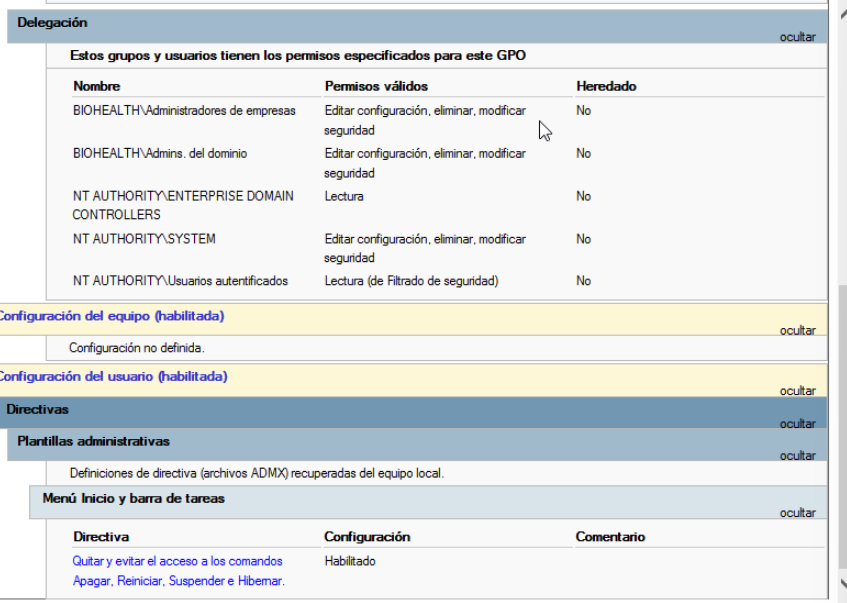
*Irudia: «Quitar y evitar el acceso a los comandos Apagar, Reiniciar, Suspender e Hibernar» → Habilitado.*

### GPO-Harrera

`Departamentuak/Harrera` OUari lotuta (harrera1, harrera2, harrera3).

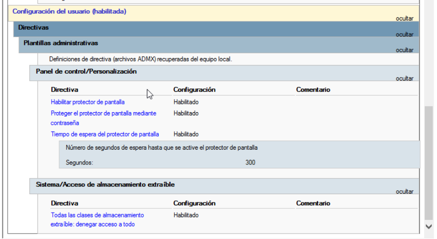
*Irudia: GPO-Harrera-ren laburpena. **1. araua – pantaila-blokeoa:** pantaila-babeslea gaituta, pasahitzarekin babestuta eta 300 segundoren (5 min) ondoren aktibatzen da. **2. araua – USBa:** «Todas las clases de almacenamiento extraíble: denegar acceso a todo» → gaituta.*

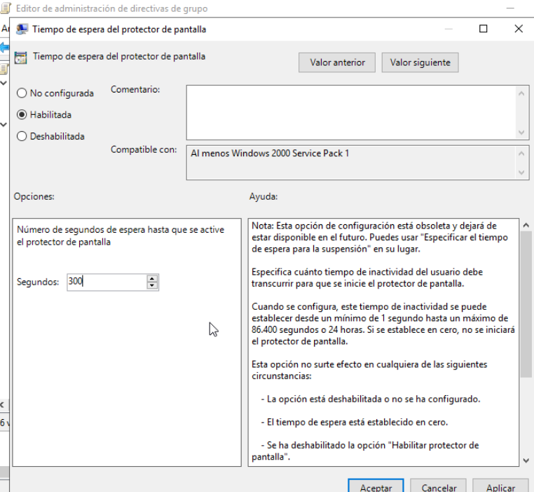
*Irudia: pantaila-babeslearen itxaron-denbora: 300 segundo.*

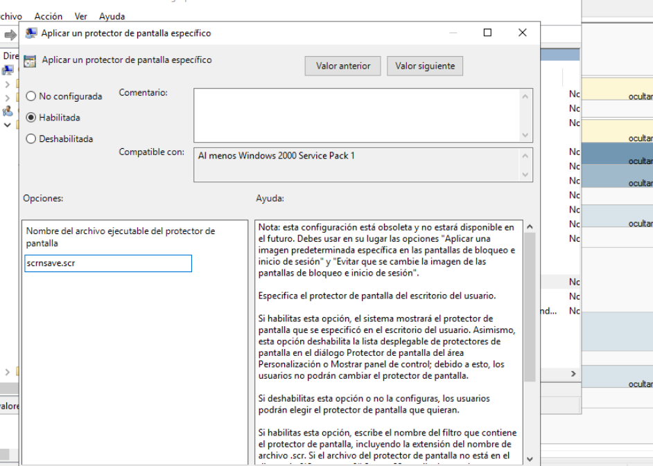
*Irudia: «Aplicar un protector de pantalla específico» → `scrnsave.scr` (pantaila beltza). Windows 11-k ez du pantaila-babeslerik lehenetsita; hau gabe, beste arauak gaituta egon arren, pantaila ez litzateke blokeatuko.*

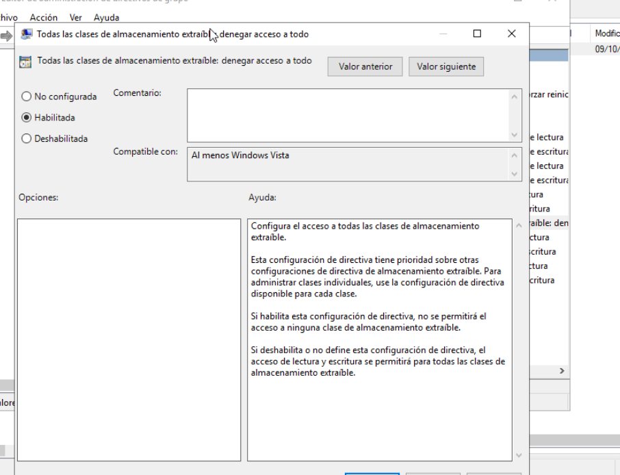
*Irudia: biltegiratze aldagarri guztiei sarbidea ukatuta (USB memoriak, disko kanpokoak, CD/DVD…), pazienteen datuak ez ateratzeko.*

### Probak (BEZ-WIN01)

| Erabiltzailea | Proba | Espero dena | Emaitza |
|---|---|---|---|
| `mediku1` | `Win+R` → `cmd` | ❌ debekatuta | ✅ «El administrador ha deshabilitado el símbolo del sistema» |
| `mediku1` | `Win+R` → `control` | ❌ debekatuta | ✅ «Restricciones» leihoa |
| `mediku1` | Hasiera → itzali botoia | Aukerarik ez | ✅ «No hay disponibles opciones de inicio/apagado» |
| `mediku1` | `gpresult /r` (PowerShell) | Panel_Blokeatu + Itzali_ez | ✅ biak aplikatuta |
| `infor1` | `Win+R` → `cmd` | ✅ irekitzen da (iragazkia) | ✅ CMD irekita |
| `infor1` | `gpresult /r` | Panel_Blokeatu iragazita | ✅ «Denegado (Seguridad)»; Itzali_ez bai aplikatuta |
| `harrera1` | 5 min itxaron | ✅ pantaila blokeatu eta pasahitza eskatu | ⏳ |
| `harrera1` | USB bat konektatu | ❌ ukatuta | IsardVDIn ezin da probatu (USB fisikorik ez); konfigurazioaren argazkiarekin justifikatuta |

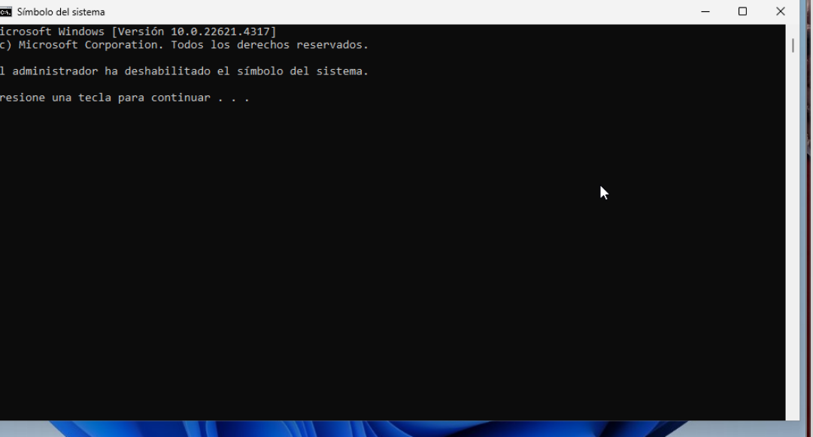
*Irudia: `mediku1`-ek CMD irekitzean: «El administrador ha deshabilitado el símbolo del sistema» → Panel_Blokeatu-ren 2. araua funtzionatzen du. ✅*

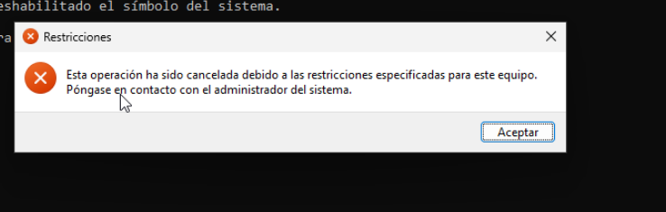
*Irudia: `control` exekutatzean «Restricciones» leihoa → Panel_Blokeatu-ren 1. araua funtzionatzen du. ✅*

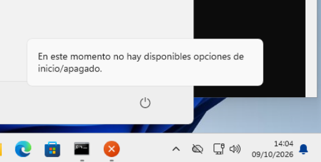
*Irudia: Hasierako itzali botoiak «En este momento no hay disponibles opciones de inicio/apagado» erakusten du → Itzali_ez funtzionatzen du. ✅*

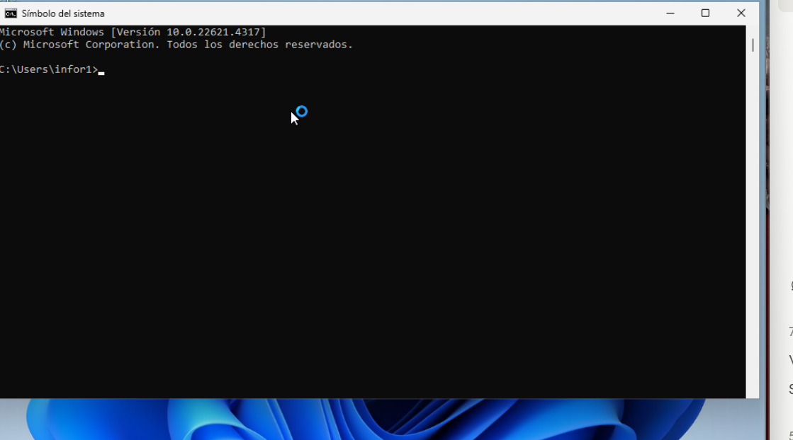
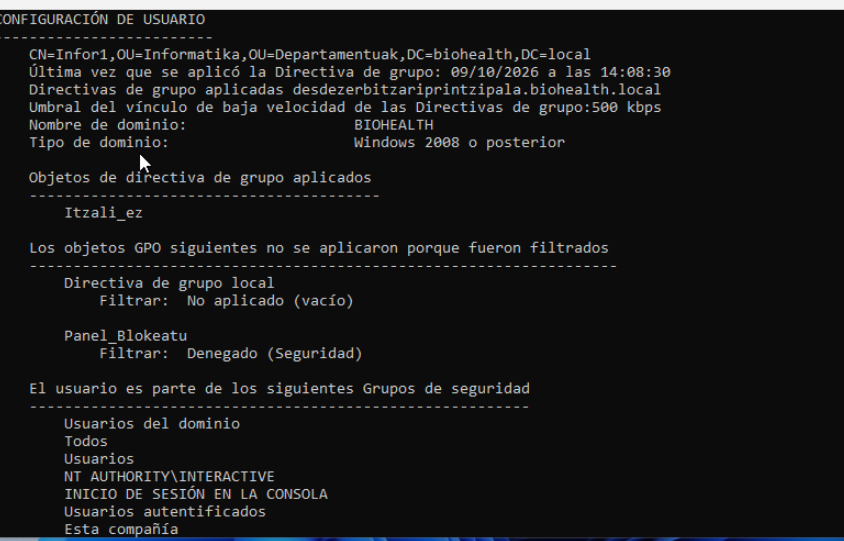
*Irudia: `infor1` (`OU=Informatika`) erabiltzailearen `gpresult /r`: **Itzali_ez** aplikatuta, eta **Panel_Blokeatu** «Filtrar: Denegado (Seguridad)» → Windows-ek berak erakusten du segurtasun-iragazkiak GPOa blokeatu duela. ✅*

*Aurreko irudia: Informatikako erabiltzaileak (`C:\Users\infor1`) CMD ireki dezake: segurtasun-iragazkiak (`informatika` taldeari «Aplicar directiva de grupo» ukatuta) Panel_Blokeatu ez aplikatzea eragiten du. ✅*

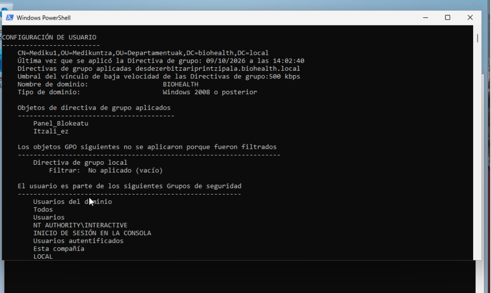
*Irudia: `gpresult /r`: `CN=Mediku1,OU=Medikuntza,OU=Departamentuak` erabiltzaileari **Panel_Blokeatu** eta **Itzali_ez** aplikatu zaizkio, zerbitzariprintzipala.biohealth.local-etik. ✅*

## Bezeroa domeinuan 🔄

| Datua | Balioa |
|---|---|
| Ekipoa | BEZ-WIN01 · Windows 11 Pro |
| IP | 192.168.10.102 (DHCP, zerbitzariaren tartean) — ikus [DHCP](../SZI-sareko-zerbitzuak/dhcp.md) |
| DNS | 192.168.10.1 (domeinu-kontrolatzailea) |
| Kontu lokala | `uni` (administratzaile lokala) |

**Pausoak:** `sysdm.cpl` → *Aldatu* → Domeinua: `biohealth.local` → domeinuko administratzaile baten kredentzialak → berrabiarazi.

- [x] BEZ-WIN01-en IPa zerbitzariaren tartean
- [x] DNS = 192.168.10.1
- [x] Domeinura batuta eta domeinuko erabiltzaile batekin (`mediku1`) saioa hasita
- [ ] `gpresult /r` → GPOak aplikatuta

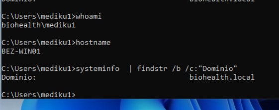
*Irudia: Medikuntza saileko `mediku1` erabiltzaileak BEZ-WIN01-en saioa hasi du. `whoami` → `biohealth\mediku1`, `hostname` → `BEZ-WIN01` eta `systeminfo` → `Dominio: biohealth.local`. Honek erakusten du bezeroa domeinuan dagoela eta direktorio-zerbitzua erabiltzaileak zentralizatuki egiaztatzeko erabiltzen dela. ✅*

## Zerbitzuen kudeaketa eta prozesuak ⏳

- [ ] AD zerbitzuak (`NTDS`, `DNS`, `Netlogon`, `KDC`) gelditu / abiarazi / berrabiarazi eta egoera egiaztatu (`services.msc` eta `Get-Service`)
- [ ] Prozesuak: Task Manager / Process Explorer (grafikoa) eta `Get-Process`, `Stop-Process`, `tasklist`, `taskkill` (komandoak)

## Arazoak eta logak

| Arazoa | Kausa | Konponbidea |
|---|---|---|
| NetBIOS izena moztuta | 15 karaktereko muga | Onartu eta dokumentatu |
| Ekipoa ezin itzali `mediku1`-en saiotik (behartu egin behar izan zen) | Itzali_ez GPOak erabiltzailearen saioan itzaltzeko aukerak kentzen ditu (nahita) | **Saioa itxi** eta saio-hasierako pantailako itzali botoia erabili (han ez dago erabiltzailearen GPOrik); edo administratzaile batekin |
