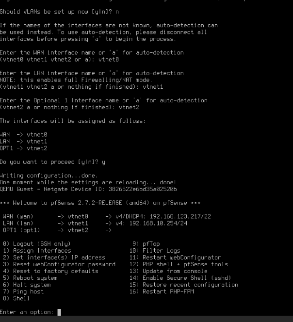
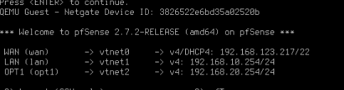
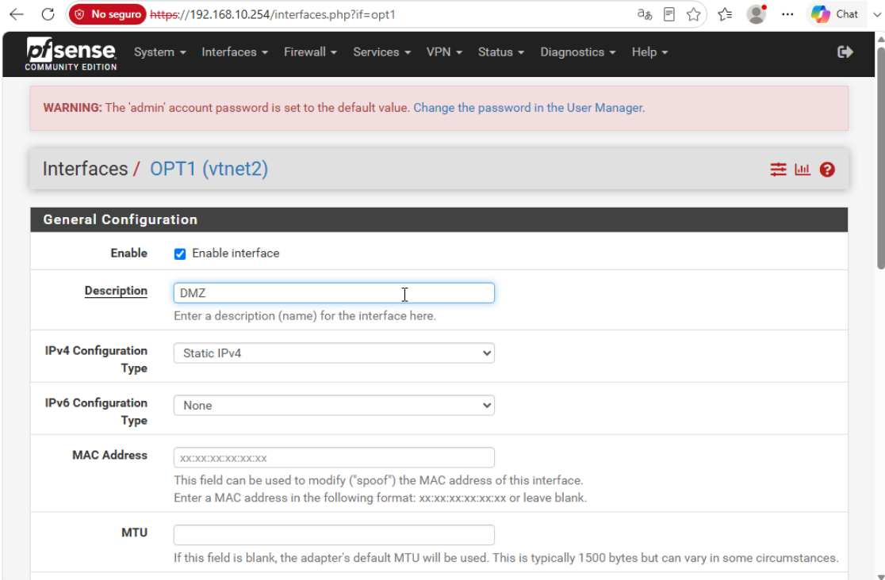
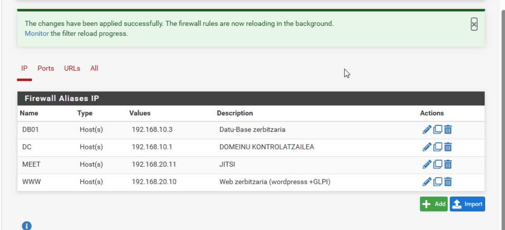
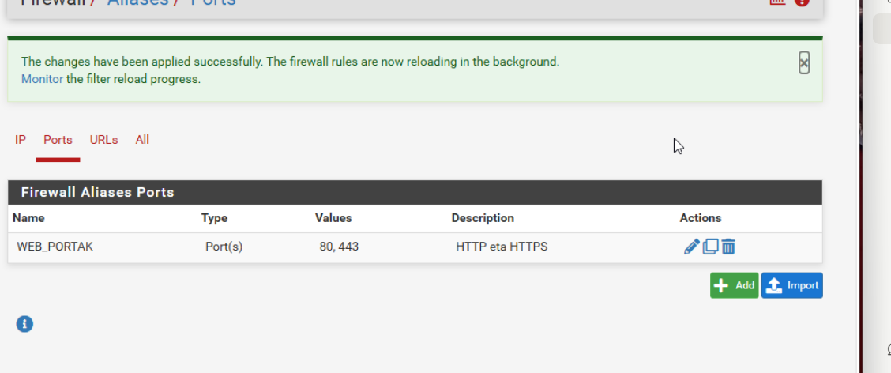
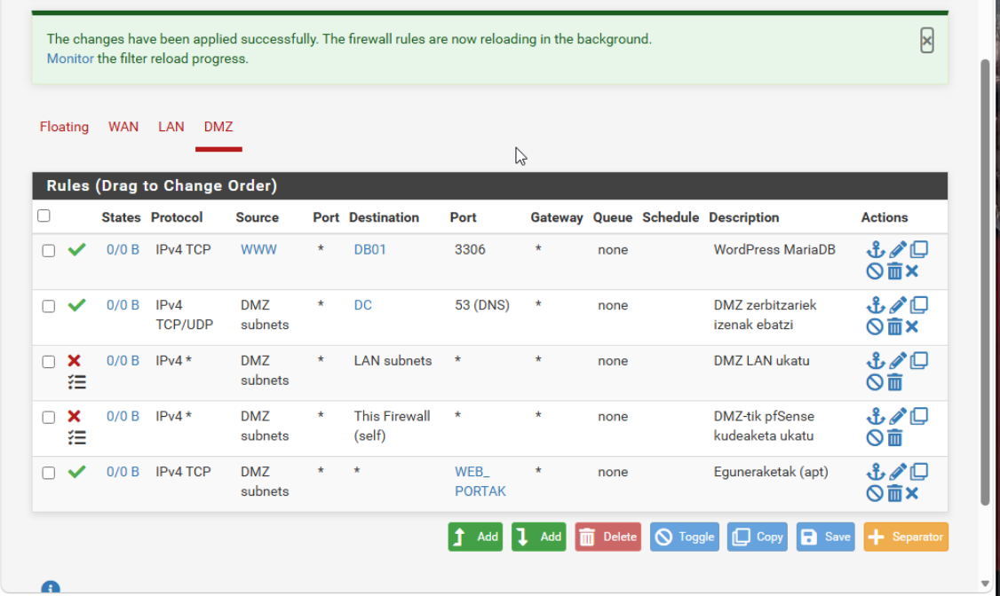
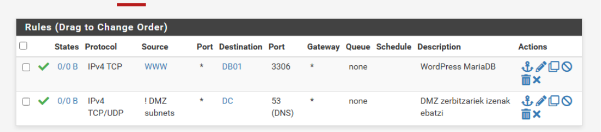

[← Hasiera](../../index.md) · [Modulua](index.md)

# Suebakia – pfSense

## Aukerak

| Aukera | Alde onak | Alde txarrak |
|---|---|---|
| **pfSense CE** | Doakoa, web GUI, stateful, Suricata eta OpenVPN/WireGuard paketeak; erronkako baliabidea | FreeBSD (Linux ez den sistema) |
| OPNsense | pfSense-ren antzekoa, interfaze modernoa | Klasean ez da landu |
| UFW / nftables | Arina | Zerbitzari bakarra babesten du, ez sare osoa |
| FortiGate | Profesionala | Ordainpekoa |

**Erabakia: pfSense CE** – kostua 0 €, sare osoa babesten du eta IDS + VPN gehitu daitezke makina berean.

## Interfazeak

| Interfazea | Gailua | IP | Oharrak |
|---|---|---|---|
| WAN | vtnet0 | DHCP (IsardVDI Default) | Internetera irteera |
| LAN | vtnet1 | 192.168.10.254/24 | pfSense-ren DHCPa **desgaituta** (Windows Server-ek ematen du) |
| DMZ (OPT1) | vtnet2 | 192.168.20.254/24 | DHCPrik gabe: DMZko zerbitzariek IP finkoa dute ✅ |

Egindakoa:
1. WAN = Default (DHCP), LAN = Pertsonala1 192.168.10.254/24 ✅
2. LAN-eko DHCPa desgaituta ✅
3. Konektibitate-proba: `ping 8.8.8.8` OK ✅
4. IsardVDIn hirugarren sare-txartela gehitu → kontsolan *1) Assign Interfaces*: `vtnet2` = OPT1 → *2) Set interface IP address*: 192.168.20.254/24, DHCPrik gabe ✅
5. Web GUI-n OPT1 → **DMZ** izena ✅
6. `admin` kontuaren pasahitz lehenetsia aldatuta (pfSense-k abisua ematen zuen) ✅

*Irudia: kontsolan interfazeak esleitzen: WAN → vtnet0, LAN → vtnet1, OPT1 → vtnet2.*

*Irudia: pfSense-ren hiru interfazeak: WAN (DHCP), LAN 192.168.10.254/24 eta OPT1 192.168.20.254/24.*

*Irudia: Interfaces → OPT1: gaituta eta «DMZ» deskribapenarekin.*

## Aliasak

Arauak irakurterrazagoak izateko eta IP bat aldatzen bada leku bakarrean aldatzeko, aliasak erabili dira:

| Alias | Mota | Balioa | Deskribapena |
|---|---|---|---|
| `WWW` | Host | 192.168.20.10 | Web zerbitzaria (WordPress + GLPI) |
| `MEET` | Host | 192.168.20.11 | Jitsi Meet |
| `DB01` | Host | 192.168.10.3 | Datu-base zerbitzaria |
| `DC` | Host | 192.168.10.1 | Domeinu-kontrolatzailea (DNS) |
| `WEB_PORTAK` | Port | 80, 443 | HTTP eta HTTPS |

*Irudia: IP aliasak.*

*Irudia: WEB_PORTAK portu aliasa.*

## Arauak

### DMZ interfazea (goitik behera aplikatzen dira; lehen bat datorrenak irabazten du)

| # | Ekintza | Protokoloa | Jatorria | Helburua | Portua | Log | Arrazoia |
|---|---|---|---|---|---|---|---|
| 1 | ✅ Pass | TCP | WWW | DB01 | 3306 | | WordPress-ek eta GLPIk datu-basea behar dute (salbuespena 3. arauaren aurretik) |
| 2 | ✅ Pass | TCP/UDP | DMZ subnets | DC | 53 (DNS) | | DMZko zerbitzariek domeinuko izenak ebatzi |
| 3 | ❌ Block | Any | DMZ subnets | LAN subnets | — | ☑ | DMZko zerbitzari bat erasotzen badute, ezin da LANera iritsi (pazienteen datuak) |
| 4 | ❌ Block | Any | DMZ subnets | This Firewall | — | ☑ | DMZtik pfSense-ren kudeaketa-webera (192.168.20.254:443) sarbidea ukatu; bestela 5. arauak baimenduko luke |
| 5 | ✅ Pass | TCP | DMZ subnets | any | WEB_PORTAK | | Eguneraketak (`apt`) eta kanpoko webguneak; LAN eta pfSense aurreko arauek blokeatu dituzte → Internet bakarrik |
| — | ❌ (inplizitua) | | | | | | Baimendu ez den guztia ukatuta (pfSense-ren lehenetsitako portaera) |

**Aldaketak proposamenarekiko:** LDAPS araua (meet → DC 636) ez da sortu, Jitsi-k oraindik ez duelako ADrekin autentifikatzen (sortuko da hori konfiguratzen bada); 4. araua gehitu da, diseinua berrikustean pfSense-ren kudeaketa DMZtik irekita geratzen zela ikusi zelako.

*Irudia: DMZ interfazearen 5 arauak, ordena zuzenean eta aplikatuta. Block arauek (✖) log-a gaituta dute (☰ ikonoa).*

### WAN (NAT – port forward)

| Kanpoko portua | Barneko helburua | Arrazoia |
|---|---|---|
| 443/TCP | www 192.168.20.10 | Web korporatiboa |
| 443/TCP (beste IP/portu bat) | meet 192.168.20.11 | Telekontsulta |
| 10000/UDP | meet 192.168.20.11 | Jitsi audio/bideoa (SRTP) |

> IsardVDIn ezin da Internetetik benetako proba egin; NATa konfiguratu eta argazkia ateratzen da, muga hori azalduz.

## IDS – Suricata ⏳

*(aukerak · erabakia · instalazioa · proba: `nmap` eskaneatze bat detektatzen du)*

## VPN – urruneko sarbidea ⏳

*(aukerak: OpenVPN / WireGuard / IPsec · erabakia · konfigurazioa · proba)*

## Probak

| Proba | Nondik | Espero dena |
|---|---|---|
| `nc -zv 192.168.10.3 3306` | www | ✅ (1. araua) |
| `ping 192.168.10.1` | www | ❌ (4. araua) |
| `https://meet.biohealth.local` | BEZ-WIN01 | ✅ |
| *Status → System Logs → Firewall* | pfSense | Blokeatutako ping-a ageri da |

## Arazoak eta logak

| Arazoa | Kausa | Konponbidea |
|---|---|---|
| OPT1 ez zen kontsolako menuan agertzen IsardVDIn txartela gehitu ondoren | pfSense-k ez ditu txartel berriak automatikoki esleitzen | *1) Assign Interfaces* → vtnet2 = OPT1 |
| Kontsolan `3` sakatu zen *2) Set interface IP*-ren ordez | 3. aukera *Reset webConfigurator password* da | `n` erantzun (aldaketarik ez); `2` sakatu eta gero interfazearen zenbakia `3` |
| 2. arauak jatorrian `! DMZ subnets` zuen | *Invert match* nahi gabe markatuta → «DMZ ez dena» | Araua editatu, *Invert match* desmarkatu. Ikasgaia: arau bakoitza sortu ondoren zerrendan berrikusi |

*Irudia: 2. araua zuzendu aurretik: `! DMZ subnets` (alderantzizkatuta).*
