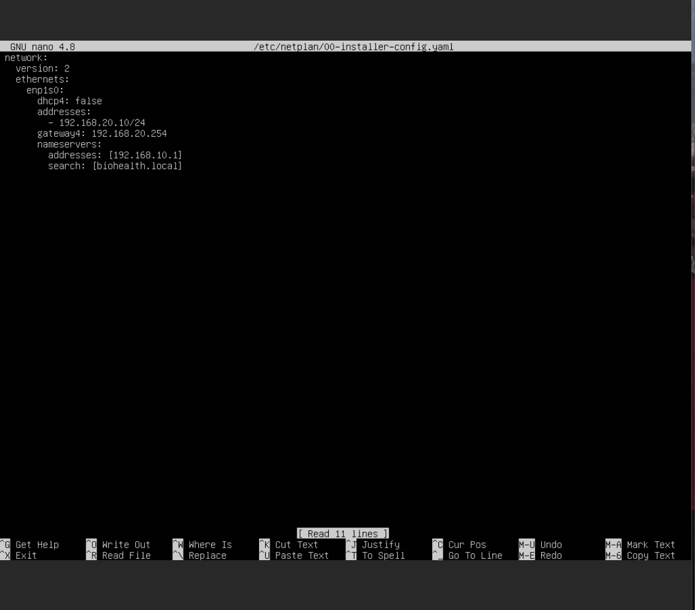
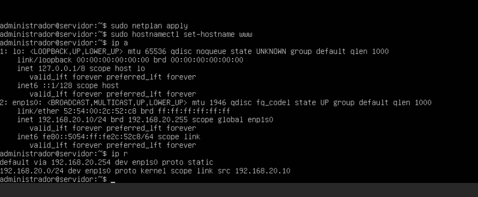

[← Hasiera](../../index.md) · [Modulua](index.md)

# Sarearen diseinua (WAN · LAN · DMZ)

## Aukerak

| Aukera | Alde onak | Alde txarrak |
|---|---|---|
| A. Sare laua (dena LAN batean) | Errazena | Web zerbitzaria erasotzen badute, LAN osora iristen dira; suebakiak ezer gutxi iragazten du |
| **B. WAN + LAN + DMZ suebaki bakarrarekin (3 interfaze)** | Zerbitzu publikoak isolatuta; arauak ikusi eta probatu daitezke; enpresa txiki baten neurrikoa | Interfaze bat gehiago konfiguratu behar da |
| C. DMZ bi suebakiren artean | Enpresa handien arkitektura | Gehiegizkoa 20 langilerentzat; bikoitza lana eta RAMa |

## Erabakia: **B**

- Internetetik sarbidea behar duten zerbitzuak (**web** eta **bideokonferentzia**) DMZn daude.
- Osasun-datuak dituzten zerbitzariak (**DC** eta **datu-basea**) LANean, inoiz ez zuzenean Internetera irekita.
- DMZtik LANera trafikoa **ukatuta** dago, behar diren salbuespenak izan ezik (ikus [pfSense](pfsense.md)).

## IP plana

| Zona | Sarea | Atebidea | IsardVDI sarea |
|---|---|---|---|
| WAN | DHCP (IsardVDI) | — | Default |
| LAN | 192.168.10.0/24 | 192.168.10.254 | Pertsonala1 |
| DMZ | 192.168.20.0/24 | 192.168.20.254 | Pertsonala2 |

| Host-izena | IP | Zona | Sistema | Zerbitzuak |
|---|---|---|---|---|
| pfsense | WAN DHCP · 10.254 · 20.254 | Ertza | pfSense 2.7.2 | Suebakia, NAT, IDS, VPN |
| zerbitzariprintzipala | 192.168.10.1 | LAN | Windows Server 2019 | AD DS, DNS, DHCP, GPO, inprimaketa |
| db01 | 192.168.10.3 | LAN | Ubuntu Server 22.04 | MariaDB 3306, MongoDB 27017 |
| BEZ-WIN01 | DHCP (.102–.200) | LAN | Windows 11 Pro | Domeinuko bezeroa |
| bez-lnx01 | DHCP | LAN | Ubuntu | Linux bezeroa (CUPS probak) |
| www | 192.168.20.10 | DMZ | Ubuntu Server | Apache + WordPress, GLPI |
| meet | 192.168.20.11 | DMZ | Ubuntu Server 24.04 | Jitsi Meet |

## Eskema

```
            Internet (IsardVDI Default)
                     │ WAN
               ┌─────┴─────┐
               │  pfSense  │
               └──┬─────┬──┘
     LAN .10.254  │     │  DMZ .20.254
   ┌──────────────┘     └──────────────┐
   │ 192.168.10.0/24                   │ 192.168.20.0/24
   ├─ zerbitzariprintzipala .1         ├─ www  .10
   ├─ db01 .3                          └─ meet .11
   └─ bezeroak .102–.200
```

## DMZko zerbitzariaren sare-konfigurazioa (www)

Ubuntu Server 20.04 (IsardVDI txantiloia) · txartela `enp1s0` · sarea Pertsonala2 · `/etc/netplan/00-installer-config.yaml`:

```yaml
network:
  version: 2
  ethernets:
    enp1s0:
      dhcp4: false
      addresses:
        - 192.168.20.10/24
      gateway4: 192.168.20.254
      nameservers:
        addresses: [192.168.10.1]
        search: [biohealth.local]
```

`sudo netplan apply` · `sudo hostnamectl set-hostname www`


*Irudia: www-ren netplan fitxategia: IP finkoa 192.168.20.10/24, atebidea pfSense-ren DMZ interfazea (.254) eta DNS domeinu-kontrolatzailea.*


*Irudia: `enp1s0` UP 192.168.20.10/24 helbidearekin eta lehenetsitako bidea `via 192.168.20.254`. ✅*

> Txantiloiak klaseko konfigurazioa zekarren (`ens1`, 192.168.71.51, `uni.lan`); osorik ordezkatu da. Lehen saiakeran `enp1s0` ondoren `:` falta zen.

## Ebidentziak

- [ ] IsardVDI: makina bakoitzaren sareak (argazkia)
- [ ] pfSense: *Interfaces* (WAN, LAN, DMZ)
- [ ] `ipconfig /all` / `ip a` makina bakoitzean
