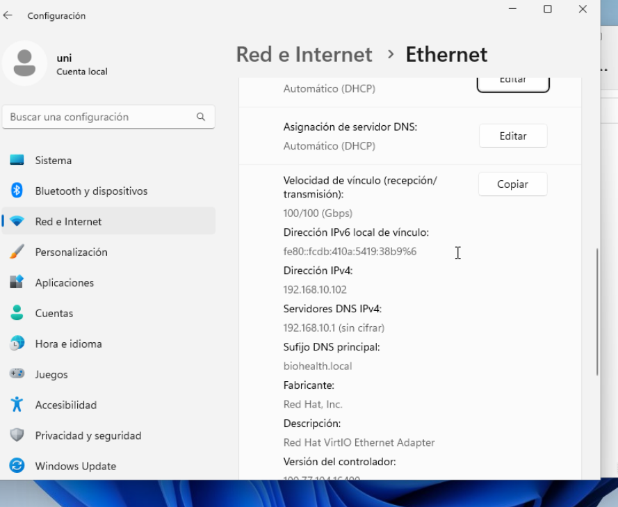

[← Hasiera](../../index.md) · [Modulua](index.md)

# DHCP

## Aukerak

| Aukera | Alde onak | Alde txarrak |
|---|---|---|
| **Windows Server DHCP** | ADn baimendua; DNS dinamikoa; erreserbak eta aukerak GUItik | Windows-en menpe |
| pfSense DHCP | Ertzean dago jada | Ez du ADrekin DNS dinamikoa egiten |
| ISC Kea (Linux) | Librea, modernoa | Zerbitzari bat gehiago |

**Erabakia: Windows Server DHCP.** pfSense-ren DHCPa desgaituta dago bi zerbitzarik gatazkarik ez izateko.

## Esparrua

| Parametroa | Balioa |
|---|---|
| Izena | Red BioHealth |
| Tartea | 192.168.10.102 – 192.168.10.200 |
| Maskara | 255.255.255.0 |
| Alokairua | 1 egun |
| 003 Router | 192.168.10.254 |
| 006 DNS | 192.168.10.1 |
| 015 Domeinua | biohealth.local |

**Tartetik kanpo (IP finkoak):** .1–.101 zerbitzari, inprimagailu eta sare-gailuentzat; .254 suebakia.

## Konfigurazio aurreratua

| Elementua | Balioa | Zergatik |
|---|---|---|
| Baimena ADn | ✅ | Baimenik gabeko DHCP zerbitzariak ez du IPrik banatzen |
| Erreserbak | *(adib. inprimagailua MAC → .50)* | Gailu batek beti IP bera |
| DNS dinamikoa | A eta PTR erregistroak eguneratu beti | Bezeroak izenez aurkitzeko |
| *(aukerakoa)* Iragazkiak / failover | | |

## Probak

```cmd
ipconfig /release
ipconfig /renew
ipconfig /all          :: IPa .102–.200 tartean, GW .254, DNS .10.1, sufixua biohealth.local
```
Zerbitzarian: *DHCP → Esparrua → Helbideen alokairuak* → bezeroa ageri da.


*1. irudia: BEZ-WIN01 bezeroak Windows Server-eko DHCPtik jaso du konfigurazioa: IPa **192.168.10.102** (esparruaren lehena), DNS zerbitzaria **192.168.10.1** (domeinu-kontrolatzailea) eta DNS sufixua **biohealth.local** (015 aukera). ✅*

## Arazoak eta logak

| Arazoa | Kausa | Konponbidea |
|---|---|---|
| | | |
