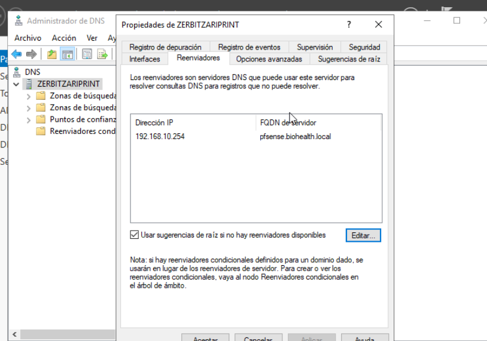
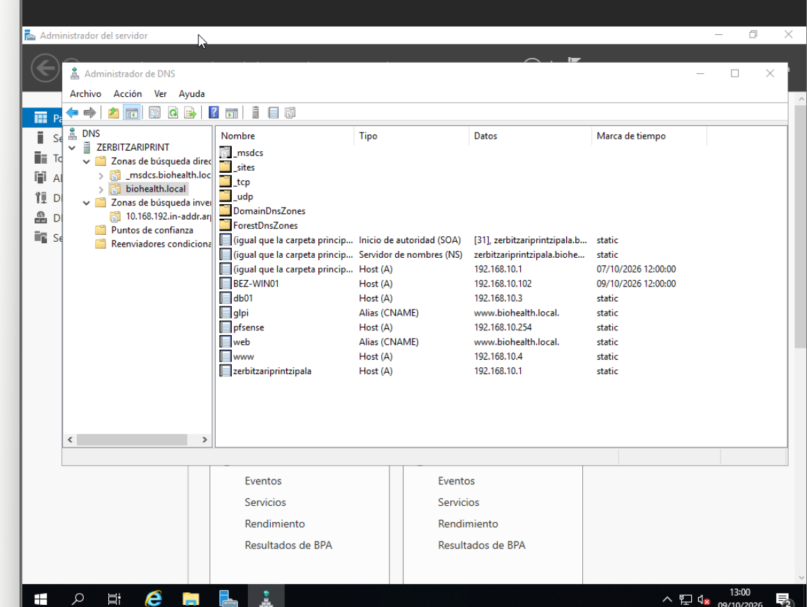
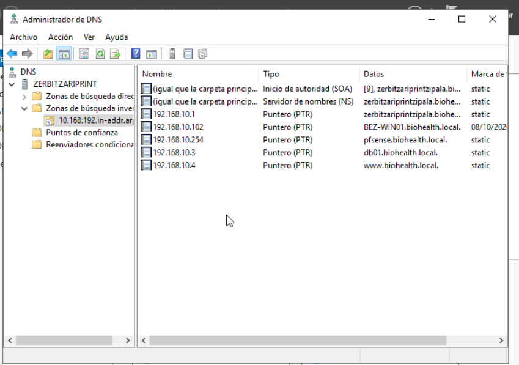
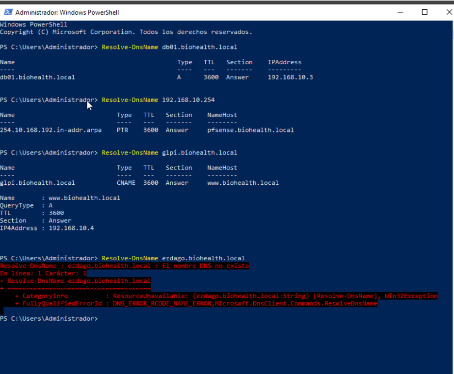
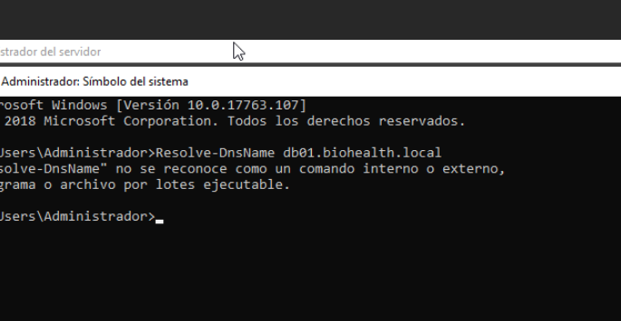

[← Hasiera](../../index.md) · [Modulua](index.md)

# DNS ✅ (LAN)

## Aukerak

| Aukera | Alde onak | Alde txarrak |
|---|---|---|
| **Windows DNS (AD-n integratua)** | ADk behar du; DHCPrekin DNS dinamikoa; replikazio automatikoa | Windows-en menpe |
| BIND9 bakarrik | Librea, estandarra | ADrekin integratzeko lan handiagoa |
| pfSense DNS Resolver | Zerbitzu bat gutxiago | Domeinuko SRV erregistroak ez ditu kudeatzen |

**Erabakia: Windows DNS AD-n integratua.**

### Kanpoko izenak ebazteko

| Aukera | Alde onak | Alde txarrak |
|---|---|---|
| **pfSense-ra birbidali (192.168.10.254)** | Irteera-puntu bakarra; suebakian DNS irteera pfSense-ri bakarrik baimendu behar zaio; pfSense-n domeinuak erregistratu eta blokeatu daitezke (pfBlockerNG) | pfSense erortzen bada ez dago kanpoko ebazpenik (baina Internetik ere ez) |
| 9.9.9.9 + 1.1.1.1 birbidaltzaileak | Fidagarriak; Quad9-k malware domeinuak blokeatzen ditu | DCa zuzenean Internetera irteten da 53 portutik → suebakian arau gehiago |
| Erro-iradokizunak soilik | Inoren menpe ez | Motelagoa |

**Erabakia: pfSense (192.168.10.254) birbidaltzaile gisa** + «Erabili erro-iradokizunak» babeskopia gisa.
Proposamenean 9.9.9.9 / 1.1.1.1 genituen; inplementatzean pfSense aukeratu dugu, kanpoko DNS trafiko guztia suebakitik kontrolatuta igaro dadin (ikus [proposamena vs. inplementazioa](../00-orokorra/proposamena-vs-inplementazioa.md)). Quad9-ren malware-iragazkia mantentzeko, pfSense-k 9.9.9.9-ra birbidal dezake.

*Irudia: ZERBITZARIPRINT DNS zerbitzariaren birbidaltzailea 192.168.10.254 (pfsense.biohealth.local) da; erro-iradokizunak babeskopia gisa gaituta. ✅*

## Zonak

| Zona | Mota | Oharrak |
|---|---|---|
| `biohealth.local` | Zuzena, nagusia, AD-n integratua | Domeinua sortzean automatikoki |
| `10.168.192.in-addr.arpa` | Alderantzizkoa, AD-n integratua | LAN ✅ |
| `20.168.192.in-addr.arpa` | Alderantzizkoa, AD-n integratua | DMZ ⏳ (DMZ sortzean) |

Eguneraketa dinamikoak: **seguruak soilik**.

## Erregistroak

| Izena | Mota | Balioa | PTR | Egoera |
|---|---|---|---|---|
| zerbitzariprintzipala | A | 192.168.10.1 | ✅ | ✅ |
| pfsense | A | 192.168.10.254 | ✅ | ✅ |
| db01 | A | 192.168.10.3 | ✅ | ✅ |
| BEZ-WIN01 | A (dinamikoa, DHCP) | 192.168.10.102 | ✅ (dinamikoa) | ✅ |
| www | A | 192.168.10.4 → **192.168.20.10** | ✅ | 🔄 orain LAN-ean; DMZ sortzean aldatuko da |
| meet | A | 192.168.20.11 | — | ⏳ Jitsi makina sortzean |
| web | CNAME | www.biohealth.local | — | ✅ |
| glpi | CNAME | www.biohealth.local | — | ✅ |

*Irudia: `biohealth.local` zona zuzena. ADk automatikoki sortutako karpetak (`_msdcs`, `_sites`, `_tcp`, `_udp`, `DomainDnsZones`, `ForestDnsZones`: domeinu-kontrolatzailea aurkitzeko SRV erregistroak), SOA eta NS erregistroak, ostatuen A erregistroak (zerbitzaria, pfsense, db01, www eta BEZ-WIN01 — azken hau DHCPk dinamikoki sortua, data-zigiluarekin) eta `web` eta `glpi` CNAME aliasak. ✅*

*Irudia: `10.168.192.in-addr.arpa` alderantzizko zona, SOA eta NS erregistroekin eta ostatuen PTR erregistroekin: zerbitzaria (.1), db01 (.3), www (.4), BEZ-WIN01 (.102, DHCPk dinamikoki sortua — ez da «static») eta pfSense (.254). ✅*

> **www-ren IPa:** gaur egun LAN-ean dago (192.168.10.4), taldearen hasierako diseinuaren arabera. DMZ sortzean 192.168.20.10-era eramango da: A erregistroa aldatu, .10.4-ren PTRa ezabatu eta `20.168.192.in-addr.arpa` zonan PTR berria sortu.

`web` eta `glpi` CNAME dira: zerbitzari batek (www) izen bat baino gehiago erantzuten ditu Apache-ren VirtualHost-en bidez.

## Pausoak (DNS Kudeatzailea)

1. Zerbitzaria → *Propietateak* → *Birbidaltzaileak* → 192.168.10.254 (pfSense) ✅
2. *Alderantzizko bilaketa-zonak* → *Zona berria* → Nagusia, AD-n gordeta → domeinuko DNS guztiei → IPv4 → `192.168.10` (eta gero `192.168.20`) → eguneraketa dinamiko seguruak
3. `biohealth.local` → *Host berria (A)* → «Sortu PTR erregistroa» markatuta
4. *Alias berria (CNAME)* → `web` eta `glpi`

## Probak (PowerShell)

| Proba | Komandoa | Emaitza |
|---|---|---|
| A erregistroa | `Resolve-DnsName db01.biohealth.local` | ✅ A → 192.168.10.3 |
| PTR (alderantzizkoa) | `Resolve-DnsName 192.168.10.254` | ✅ PTR → pfsense.biohealth.local |
| CNAME (aliasa) | `Resolve-DnsName glpi.biohealth.local` | ✅ CNAME → www.biohealth.local → A 192.168.10.4 |
| Existitzen ez den izena | `Resolve-DnsName ezdago.biohealth.local` | ❌ «El nombre DNS no existe» (`DNS_ERROR_RCODE_NAME_ERROR`) — espero zena |

*Irudia: DNS zerbitzariaren probak. Erregistro-mota bakoitza (A, PTR, CNAME) behar bezala ebazten da eta existitzen ez den izenak errorea ematen du: zerbitzariak bere zonetako datuekin bakarrik erantzuten du. ✅*

Egiteko: `Resolve-DnsName google.com` (pfSense birbidaltzailearen proba) eta `nslookup -type=SRV _ldap._tcp.biohealth.local` (ADren SRV erregistroak).

## Arazoak eta logak

*Gertaeren ikustailea → Aplikazioen eta zerbitzuen erregistroak → DNS Server*

| Arazoa | Kausa | Konponbidea |
|---|---|---|
| `"Resolve-DnsName" no se reconoce como un comando interno o externo` | Komandoa CMD-n (Símbolo del sistema) exekutatu zen; `Resolve-DnsName` PowerShell-eko cmdlet bat da | Leiho berean `powershell` idatzi (edo PowerShell ireki) eta berriro exekutatu. CMD-n baliokidea `nslookup` da |

*Irudia: `Resolve-DnsName` CMD-n exekutatzean ateratako errorea.*
